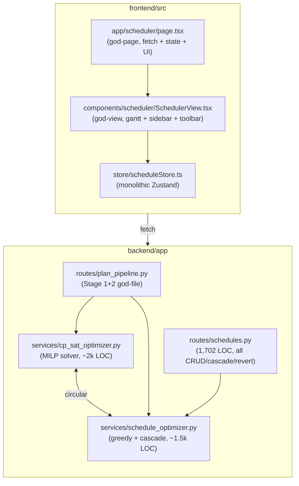
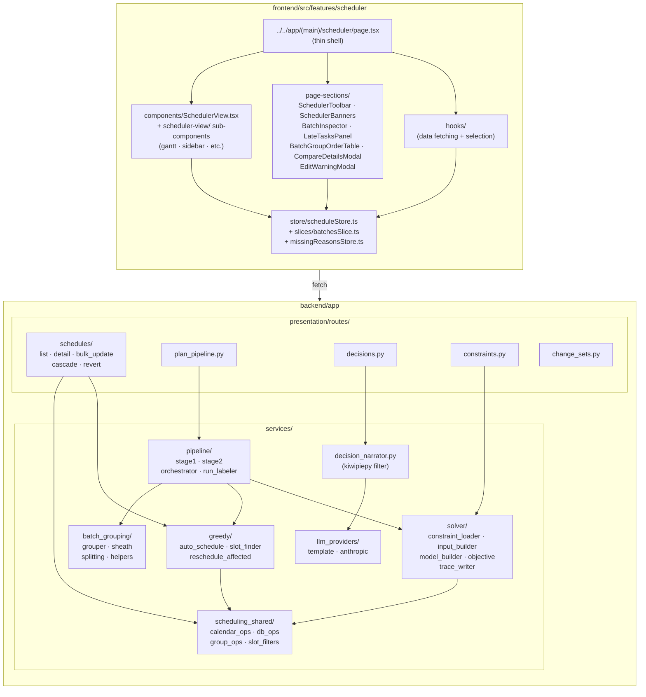

# Architecture: As-Is → To-Be

**Audience:** anyone joining the project after the Production Handoff
Refactor (Weeks 0-9). The two diagrams below show how the codebase
looked before the refactor (god-files, circular imports) and how it
looks now (packages, one-way deps, sliced state).

Both diagrams render natively in GitHub markdown.

---

## As-Is (pre-Week-2)

Pain points the diagram makes obvious:

- **Bidirectional `cp_sat_optimizer ↔ schedule_optimizer` import** —
  any change to either file risked an import-cycle traceback.
- **Three god-files own everything in their layer.** A single PR for a
  small admin tweak required edits to a 1,702-LOC route, a 2k-LOC
  optimizer, and a sprawling `page.tsx`.
- **No seam for tests.** Mocking the LLM, the calendar, or the WIP
  matcher meant patching deep into the optimizer file.

---

## To-Be (post-Week-9)

Wins this layout buys:

- **Each package has one responsibility.** `solver/` builds and runs
  the MILP; `greedy/` does heuristic placement; `scheduling_shared/`
  holds the pieces both need (calendar arithmetic, DB ops, slot
  filters). No circular imports.
- **Routes are thin.** `routes/schedules/` is now five small files,
  each owning one HTTP verb-shape. The previous 1,702-LOC `schedules.py`
  is gone.
- **Frontend has a real layered shape.** `page.tsx` is a shell;
  `page-sections/` carries the major UI regions; `components/`
  carries the leaf widgets; `store/slices/` lets each domain own its
  Zustand slice without colliding.
- **The Decision Card pathway is its own seam.** `routes/decisions.py
→ decision_narrator.py → llm_providers/{template,anthropic}.py` is
  testable end-to-end without touching the legacy `llm_explainer.py`.
